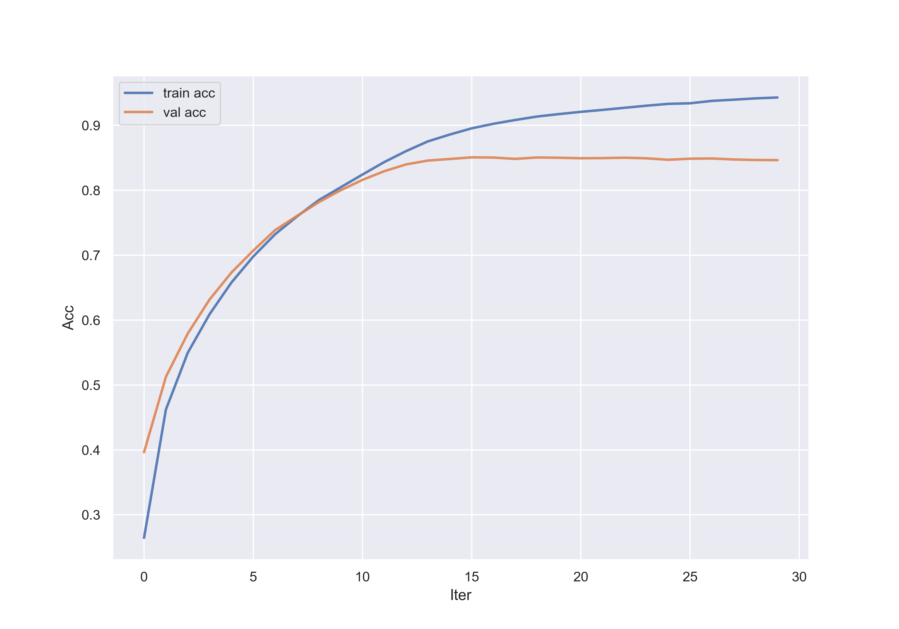
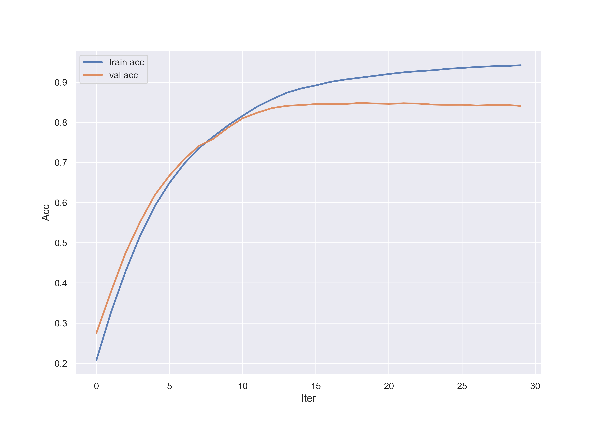

# 新闻文本分类
初学者的文本分类任务

## model
* RNN
* LSTM
* GRU

## 准备
```
conda create -n zh python=3.9
conda activate zh
python3 -m pip install --upgrade pip
pip3 install -r requirements.txt
```

* **配置:** *NVIDIA TITAN Xp*
* **batch size:** *1000*
* **用时:** *8s/epoch*
* **训练总轮次:** *30*
## 数据集
* [头条新闻](https://github.com/aceimnorstuvwxz/toutiao-text-classfication-dataset)

## 运行
* 数据预处理

首先要把原始的文本数据进行预处理，创造词典。
运行如下代码进行数据预处理
```commandline
python run.py --preprocess
```
*此步骤需要花费较长时间，可以选择去[这里](https://drive.google.com/file/d/11K2Kd_DeiEKrGPpiznDqhoxuIMLJldlz/view?usp=sharing)下载已经处理好的数据。*

* 训练
```commandline
python run.py --epochs 30 --batch_size 1000
```
或者运行脚本
```commandline
bash run.sh
```

## 实验结果
* lstm

Test acc: **84.91%**

训练acc趋势图


* rnn

Test acc: **84.35%**

训练acc趋势图


* gru

Test acc: **84.57%**

训练acc趋势图


## 总结
从训练acc趋势图中明显看出发生了过拟合现象，但是因为第一次正式做文本领域的任务，
无法 从根本上得到找到原因。